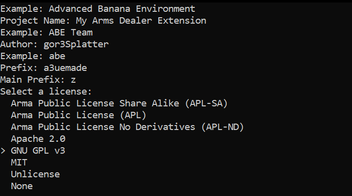
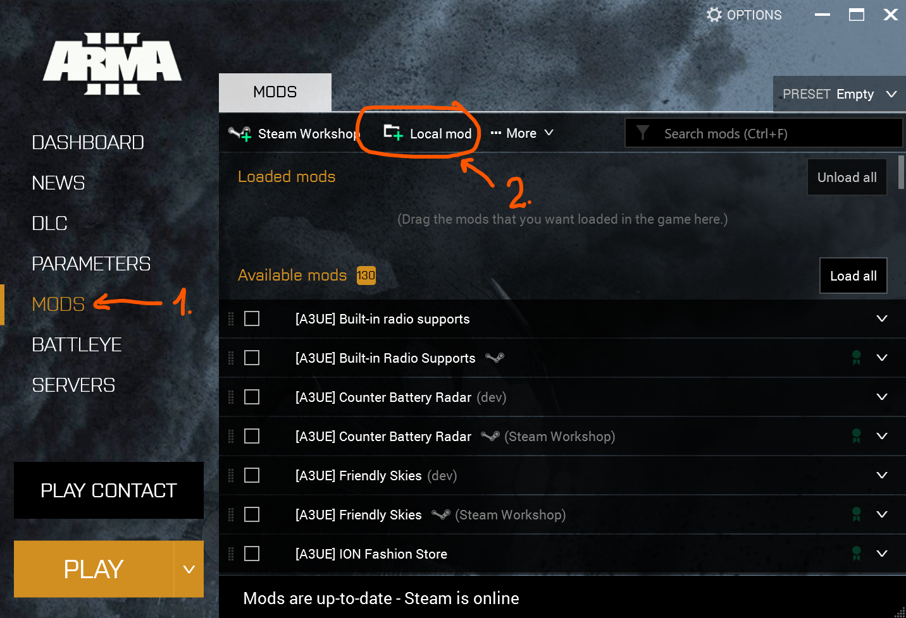

# A3UExtender - Arms Dealer

Adding stuff to the arms dealer requires a dedicated mod _you must write
yourself._

DO NOT extract A3U .pbos and repack them or create workshop mods that
replicate the whole `hals_store` addon, or worse, the whole mod.

## Terminology

- **Addon** - a functionally segregated part of a mod; always has a `config.cpp`
and _may_ result in a `.pbo` file. Also called _components_ in CBA architecture.
- **Mod** - a collection of _addons_ that can be uploaded to the workshop.

## Requirements

- Arma 3 - The game. Duh.
- [Arma 3 Tools][arma-3-tools] - For publishing your extender.
- [Git][git-for-windows] - Source code versioning
- [HEMTT][hemtt] - Quite opinionated build system - to build your extender.
- [CBA][cba] - Community Based Addons for Arma 3

Also, a decent editor:
- VSCode - a requirement mentioned [here](readme.md#visual-studio-code-method) already.
- [Notepad++][npp-link] - if you must.

### Environment

This article assumes you're working in VSCode; if you're using any other editor,
you're on your own. Figure out the deviating commands yourself, please.

When mentioning `git commit`, you might want to use VSCode's source control
panel rather than the command line.

When mentioning `hemtt check`, this assumes you have the project loaded in
VSCode and a terminal panel open ("F1" >> "Create new terminal (with profile)" >>
"my-arms-dealer-extension" >> "PowerShell").

## Setup

### Initialize project

We'll crate an extender that adds stuff from the Reaction Forces DLC to the
store.

Follow project initialization instructions from the
[HEMTT book][hemtt-command-new]. For demonstration purposes, we'll create a
project called `my-arms-dealer-extension` (**MADE**).



That should leave you with a project structure
like this:

```
<my-arms-dealer-extension> /
   | .git
   | .hemtt
   +---- project.toml
   | addons
   | .gitignore
   | LICENSE
```

> [!TIP]
> `git commit` is your friend. Regularly commit changes made to the project;
> especially _before_ bigger changes to the project.
>
> The initial project structure is uncommitted. Time for your first commit!

### Main addon

The main addon should define the mod itself, dependencies and globally used
stuff for your mod; _ideally_, it's a collection of meta-data, no code.

Let's set up our main addon.

> [!IMPORTANT]
> Please suppress the urge to simply copy/paste stuff from below. Try to
> understand what each file does and especially, where you'll need to make
> adjustments for _your_ mod.

1. Create `addons/main/$PBOPREFIX$` with this content (`z\a3uemade` is a 
   combination of what you've entered [above](#initialize-project) as "prefix"
   and "main prefix" during initialization):
    ```
    z\a3uemade\addons\main
    ```

2. Create `addons/main/script_component.hpp` with this content:
    ```sqf
    #define COMPONENT main
    #include "script_mod.hpp"
    #include "script_macros.hpp"

    ```

3. Create `addons/main/script_mod.hpp`:
    ```sqf
    // COMPONENT should be defined in the script_component.hpp and included BEFORE this hpp
    #define PREFIX a3uemade

    #include "script_version.hpp"

    #define VERSION     MAJOR.MINOR
    #define VERSION_STR MAJOR.MINOR.PATCHLVL.BUILD
    #define VERSION_AR  MAJOR,MINOR,PATCHLVL,BUILD

    // MINIMAL required Arma version for the Mod. Components can specify others..
    #define REQUIRED_VERSION 2.20

    ```

4. Create `addons/main/script_version.hpp`:
    ```sqf
    #define MAJOR 1
    #define MINOR 0
    #define PATCHLVL 0
    #define BUILD 000000

    ```

5. Create `addons/main/script_macros.hpp`:
    ```sqf
    // The mod's main prefix as defined as "main prefix" during initialization
    #define MAINPREFIX z
    // Community Based Addons - common macros
    #include "\x\cba\addons\main\script_macros_common.hpp"

    // All your global mod-specific macros go after this line
    /* ... */
    #ifndef QPREFIX
        #define QPREFIX QUOTE(PREFIX)
    #endif // QPREFIX

    ```

6. Create `addons/main/config.cpp` with this content:
    ```sqf
    #include "script_component.hpp"

    class CfgPatches {
        class ADDON {
            name = CSTRING(component);
            units[] = {};
            weapons[] = {};
            requiredVersion = REQUIRED_VERSION;
            requiredAddons[] = {
                // Add dependency to Antistasi Ultimate
                "A3A_ultimate",
                // We're going to be adding stuff from RF
                "RF_Weapons"
            };
            // Make this mod load _only_ if all the above dependencies are satisfied
            skipWhenMissingDependencies = 1;
            author = CSTRING(Author);
            authors[] = {};
            url = CSTRING(URL);
            VERSION_CONFIG;
        };
    };

   ```

7. Finally, create `addons/main/stringtable.xml`:
    ```xml
    <?xml version="1.0" encoding="utf-8"?>
    <Project name="A3UEMADE">
        <Package name="Main">
            <Key ID="STR_A3UEMADE_Main_Author">
                <Original>UnseenKill/goreSplatter</Original>
                <German>UnseenKill/goreSplatter</German>
            </Key>
            <Key ID="STR_A3UEMADE_Main_Component">
                <Original>[A3UE] MADE - Main component</Original>
                <German>[A3UE] MADE - Hauptkomponente</German>
            </Key>
            <Key ID="STR_A3UEMADE_Main_URL">
                <Original>https://github.com/</Original>
            </Key>
        </Package>
    </Project>

    ```

> [!TIP]
> `hemtt check` is your friend. Run this command often; especially after bigger
> changes. A good project is an error- and warning-free project! Run it now.

8. HEMTT should have complained about the `#include` to CBA's common scripts
file. It needs to be added as an external include for HEMTT. Copy
[this file][cba-common_include] to 
`include\x\cba\addons\main\script_macros_common.hpp`.

9. Rerun `hemtt check`.

10. Commit your changes.

## The juice

Now that we have a mod-skeleton in place which doesn't do a lot by itself, it's
time for the _actual_ project.

### Store addon

Add a new addon to the mod project structure. Call it `store` and follow these steps:

1. Create `addons/store/$PBOPREFIX$`
    ```
    z\auemade\addons\store
    ```

2. Create `addons/store/script_component.hpp`
    ```sqf
    #define COMPONENT store
    #include "\z\a3uemade\addons\main\script_mod.hpp"
    #include "\z\a3uemade\addons\main\script_macros.hpp"

    // Macros _local_ to the addon (i.e. not used outside of it) go here
    #define ITEM(CLASSNAME, PRICE, STOCK)\
        class CLASSNAME {\
            price = PRICE;\
            stock = STOCK;\
        }

    #define MAGAZINE_STOCK 200
    #define LAUNCHER_STOCK 15
    #define PISTOL_STOCK 50
    #define RIFLE_STOCK 20
    #define MZ_STOCK 50
    #define NN_STOCK 50
    #define PN_STOCK 25
    #define MISC_STOCK 50

    ```

3. Create `addons/store/config.cpp`
    ```sqf
    #include "script_component.hpp"

    class CfgPatches {
        class ADDON {
            name = CSTRING(component);
            units[] = {};
            weapons[] = {};
            requiredVersion = REQUIRED_VERSION;
            requiredAddons[] = {
                // Require our main addon
                QUOTE(MAIN_ADDON),
                // We're updating A3U's store, so the HALS store addon is required, too
                "A3A_hals"
            };
            author = ECSTRING(main,Author);
            authors[] = {};
            url = ECSTRING(main,URL);
            VERSION_CONFIG;
        };
    };

    ```

4. Update `stringtable.xml` in `addons/main` or create one for this addon specifically.

    ```xml
    <Package name="Store">
        <Key ID="STR_A3UEMADE_Store_Component">
            <Original>[A3UE] MADE - Store component</Original>
            <German>[A3UE] MADE - Storekomponente</German>
        </Key>
    </Package>

    ```

5. Test changes, run `hemtt check`.

6. Commit your changes.

### Store configuration

A3U's hals store items are configured as class-based config entries. Let's all
put them in a dedicated include file.

1. Create `addons/store/CfgHalsStore.hpp`

    This will instruct Antistasi Ultimate to look for our store if all the
    required mods/addons are loaded.

    ```sqf
    // Antistasi Ultimate configuration
    class A3A {
        class traderAddons {
            class addons_base;

            // Our store class
            class DOUBLES(addons,PREFIX): addons_base {
                addons[] = {
                    // Add a requirement to our mod, not just RF
                    QUOTE(MAIN_ADDON),
                    // We require RF_Weapons addon loaded; don't show store if not loaded.
                    "RF_Weapons"
                };
                // Reference to traderWeapons sub-class below
                weapons = QUOTE(DOUBLES(weapons,PREFIX));
            };

            class traderWeapons {
                class weapons_base;
                class DOUBLES(weapons,PREFIX): weapons_base {
                    // Defines the available store referenced below
                    prefix = DOUBLES(PREFIX,store);
                };
            };
        };
    };

    // HALs store addon configuration
    class CfgHALsAddons {
        class CfgHALsStore {
            class stores {
                class DOUBLES(PREFIX,store) {
                    displayName = "$STR_ARMS_DEALER_STORE";
                    categories[] = {
                        // Miscellaneous category defined below
                        QUOTE(TRIPLES(PREFIX,store,misc)),
                        // Weapons category defined below
                        QUOTE(TRIPLES(PREFIX,store,weapons))
                    };
                };
            };

            class categories {
                class TRIPLES(PREFIX,store,misc) {
                    // Result: "A3UEMADE - Miscellaneous"
                    displayName = __EVAL(formatText ["%1 %2", QPREFIX, localize "STR_A3AU_misc"]);
                    // Arma 3 backpack icon
                    picture = "a3\ui_f\data\gui\Rsc\RscDisplayArsenal\backpack_ca.paa";

                    /*
                        Add store items here.

                        We're using the ITEM() macro defined earlier in `script_component.hpp`

                        Syntax is:
                            ITEM(className,price,stock);
                    */

                    // Drone40 HE - base price: 5000, stock: three units
                    ITEM(1Rnd_RC40_HE_shell_RF,5000,3);
                    // Drone40 Blue Smoke - base price: 2500, stock: ten units
                    ITEM(1Rnd_RC40_SmokeBlue_shell_RF,2500,10);
                };

                class TRIPLES(PREFIX,store,weapons) {
                    // Result: "A3UEMADE - Rifles"
                    displayName = __EVAL(formatText ["%1 %2", QPREFIX, localize "STR_A3AU_rifles"]);
                    // Arma 3 long rifle icon
                    picture = "a3\ui_f\data\gui\Rsc\RscDisplayArsenal\primaryWeapon_ca.paa";

                    // Veles-S 12.7mm - base price: 3500, stock: A3U rifle default stock quantity (20 units)
                    ITEM(arifle_ash12_LR_blk_RF,3500,RIFLE_STOCK);
                };
            };
        };
    };

    ```

    For additional categories (especially their category locale strings & pictures), refer to [this file][a3u-hals_rf_sample_include].

2. Include our new config in this addon's `config.cpp`. Add this line to it:
    ```sqf
    #include "CfgHalsStore.hpp"
    ```

3. Check validity with `hemtt check`.

4. Commit your changes.

## Building

In your terminal window, simply run `hemtt build`.

In a jiffy, this should have created the directory
`<my-arms-dealer-extension>\.hemttout\build` which is your "raw" mod ready for
testing. Referred to as the **build directory** in this article.

## Testing

### One-time setup

After a successful build, you need to add the **build directory** as a local mod
in the Arma launcher.



In the upcoming dialog, navigate to your **build directory** and hit "Select folder".

The mod should show up as an available mod in the list now.

### Run the test

Activate mods "CBA_A3", "Antistasi Ultimate - Mod" and your mod.

For this demonstration, under DLC, also activate Reaction Forces DLC.

Run.

## Subsequent tests

After you've added more items to the store, a `hemtt build` and launch via the
Arma launcher is sufficient.

## Releasing

This assumes your mod has a fancy logo handy in a file `a3uemade.paa`. If not,
delete the corresponding lines referring to the file.

1. Create `mod.cpp`

    Adjust contents as needed for your extension.

    ```
    name = "[A3UE] My Arms Dealer Extension";
    picture = "a3uemade.paa";
    actionName = "Website";
    action = "https://github.com";
    description = "My Arms Dealer Extension v1.0.0";
    logo = "a3uemade.paa";
    logoOver = "a3uemade.paa";
    tooltip = "My Arms Dealer Extension";
    tooltipOwned = "My Arms Dealer Extension Owned";
    overview = "It's an arms dealer extension for Antistasi Ultimate.";
    author = "goreSplatter";
    overviewPicture = "a3uemade.paa";
    overviewText = "My Arms Dealer Extension overviewText";
    overviewFootnote = "<br /><br /><t color='#999999'>This content is under Arma Public License Share Alike (APL-SA) License.<br />Press <t /><t color='#19d3ff'>Left Shift + P<t /><t color='#999999'> to open the store page for more information.<t />";

    ```

2. Make this file and others part of the release; edit `.hemtt/project.toml`:
    ```toml
    [files]
    include = [
        "a3uemade.paa",
        "LICENSE",
        "README.md",
        "mod.cpp"
    ]

    ```

3. Commit changes

4. Run HEMTT release

    In the terminal, run `hemtt release`.

    A good release command would have created `releases/a3uemade-latest.zip`.

5. Publish using Arma Tools

### Subsequent releases

Don't forget to update the version in `addons/main/script_version.hpp` before each release!

[a3u-hals_rf_sample_include]: https://github.com/Antistasi-Ultimate-Community/A3-Antistasi-Ultimate/blob/stable/A3A/addons/hals/Addons/store/config/rf.hpp
[arma-3-tools]: https://store.steampowered.com/app/233800/Arma_3_Tools/
[cba]: https://steamcommunity.com/sharedfiles/filedetails/?id=450814997
[cba-common_include]: https://github.com/CBATeam/CBA_A3/blob/release/addons/main/script_macros_common.hpp
[git-for-windows]: https://git-scm.com/install/windows
[hemtt]: https://hemtt.dev/
[hemtt-command-new]: https://hemtt.dev/commands/new.html
[npp-link]: https://notepad-plus-plus.org/
